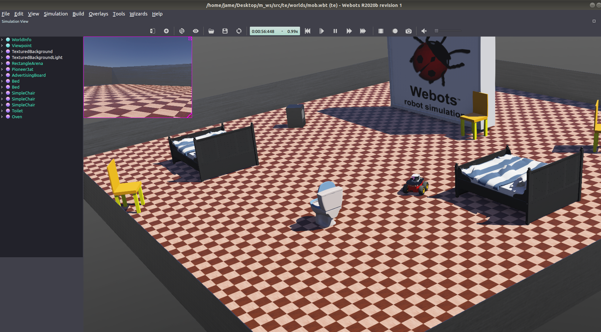

# webots_ROS
　　This is a practical case of combining [**Webots**](https://cyberbotics.com/) and [**ROS (Ubuntu 18.04)**](http://wiki.ros.org/melodic/Installation/Ubuntu). It uses [**Gmapping**](http://wiki.ros.org/gmapping) to build maps, and also uses [**ORB3**](https://github.com/UZ-SLAMLab/ORB_SLAM3) monocular vision positioning to build maps.  
  
   
  
  
  
  
  
  
  ## Requirements  
　　[**Install Webots**](https://cyberbotics.com/)  
　　[**Install ROS and "webots_ros" Package**](https://cyberbotics.com/doc/guide/tutorial-8-using-ros)  
　　[**Install Gmapping**](http://wiki.ros.org/gmapping)  
　　[**Install ORB3-SLAM**](https://github.com/UZ-SLAMLab/ORB_SLAM3)  
  　　     
         
　　The project itself is a ROS package. You only need to download it in your `catkin_workspace` and change the path in the launch file, then run `catkin_make`.  
　　For more information:   
　　　　[**My blog**](https://www.guyuehome.com/34537)  
    
    
  　　
            
  
  
  
  
  
